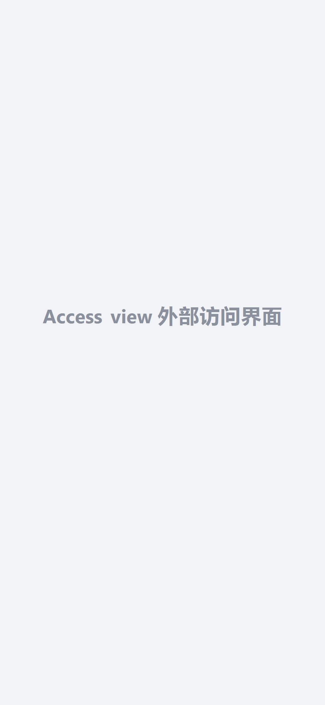
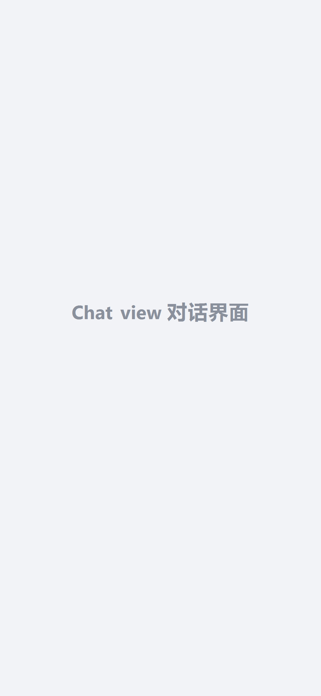

#  DSH-Mobile — DeepSeek Harness, in your pocket

**English** | [中文](README.zh.md)

<p align="center">
  
  
  
  
  
  <a href="https://github.com/topics/dsh-plugin"></a>
</p>

> **Pair once by QR code — then watch and control your desktop DeepSeek Harness from your phone, anywhere.**
> 扫码配对一次，之后随时随地用手机查看/控制电脑上的 DeepSeek Harness。

**DSH-Mobile** is a native Android companion app for the official
[DeepSeek Harness (DSH)](https://github.com/deepseek-ai/deepseek-harness)
Web UI. It pairs with your desktop `dsh web` via a QR code, loads the **official
DSH interface** full-page (not an iframe), and keeps you in the loop even when
the app is closed: a persistent notification mirrors the desktop's native
progress text second-by-second.

## ✨ What it does

| Capability | Description |
|------------|-------------|
| 📷 **Scan-to-pair** | Scan the QR code from `dsh web → Settings → Plugins → Phone access`, or enter the URL manually |
| 🔐 **PIN auto-login** | First-time 8-digit PIN entry is handled natively and stored **encrypted** (AndroidKeyStore AES-GCM); pairing history survives app restarts |
| 🖥️ **Full-page official UI** | The remote page is loaded as top-level navigation — session cookies and WebSockets work exactly like the desktop browser; narrow-screen adaptation is done server-side by the `dsh-web-mobile` plugin |
| 🔔 **Live status notification** | A persistent notification mirrors the desktop's native status line (`Deep diving...1分45秒`) second-by-second; when the run ends it switches to `已完成 · 本次用时` — no self-computed timing, it always matches the desktop |
| 🌐 **LAN + public tunnel** | Direct connection on the same Wi-Fi; cloudflared quick tunnel for outside access (URL rotates per restart) |
| 🌙 **Dark mode + bilingual** | Follows DSH's `data-ds-dark-theme`; zh/EN switching inside the app |
| 📶 **Pairing status dots** | Online / offline / password-protected shown right in the pairing list (green / red / lock) |
| 🔔 **Notification permission** | Android 13+ runtime permission flow on first launch |

> **Desktop DSH is the cockpit; DSH-Mobile is the copilot in your pocket.**

## 📸 Screenshots

**🖼️ Promo poster** — scan once, then watch and control your desktop harness from anywhere:


**📱 Access view** — pairing list / scanner / remote access entry (screenshot pending — drop yours at `assets/screenshots/access-view.png`):



**💬 Conversation view** — the official DSH interface, full-page on your phone (screenshot pending — drop yours at `assets/screenshots/chat-view.png`):



> **App icon** — `assets/app-icon.png` doubles as the launcher icon in the APK build:


## 🖼️ Architecture

```
┌──────────────┐  scan / manual pair      ┌────────────────────────────┐
│ DSH-Mobile   │ ───────────────────────→ │ desktop dsh web (:3080)    │
│ Capacitor    │  URL (LAN :3081 or       │  ├ official DSH Web UI     │
│ Android shell│  public trycloudflare)   │  ├ .Md3f7G_turnStatus      │
│  ├ SecureStore (Keystore-encrypted)     │  │  native status text      │
│  ├ AuthBridge (native PIN login/nav)    │  └ dsh-pocket proxy (PIN)  │
│  ├ QrScanner (CameraX+ZXing, no GMS)    └────────────────────────────┘
│  └ MainActivity status poll → notify  │
└──────────────┘
```

Key design decisions:

- **Full-page navigation, not iframe**: `AuthBridgePlugin.open()` loads the
  remote URL at top level, making it same-site so cookies/WebSockets work
  without hacks; the Android back button returns to the pairing list.
- **No-cookie probe**: `check()` temporarily disables the cookie jar so the
  PIN gate is detected even when a planted session cookie would mask it.
- **Live status sync**: `MainActivity` polls the desktop page every 2 s and
  reads the *native* `.Md3f7G_turnStatus` text (with its own timer) — the
  notification always mirrors what the desktop shows, never a local estimate.
  4 identical reads in a row = run finished → `已完成 · 本次用时 <elapsed>`.

## 🚀 30-second quick start

```sh
# 1. On the desktop: install the two server-side plugins, then run dsh web
dsh plugin --profile web add dsh-pocket -w
dsh plugin --profile web add github:mexiaosqwq/dsh-web-mobile
npx @deepseek-ai/dsh web

# 2. Build & install the APK on your phone (or grab a Release APK)
cd app && npm install && npx cap sync android
cd android && .\gradlew.bat :app:assembleDebug
adb install -r app\build\outputs\apk\debug\app-debug.apk

# 3. Open the app → 「扫码配对」→ scan the QR code in
#    dsh web → Settings → Plugins → Phone access → done 🎉
```

> The LAN access PIN (`lanAuthEnabled`) is **on by default** — the secure
> default. The app guides you through the first 8-digit PIN entry and stores
> it encrypted; you can disable it in plugin settings (personal-network only).

## Why this approach

- **The app is a shell, not a re-implementation**: the official DSH Web UI is
  loaded untouched. No core logic is rewritten, no UI is re-skinned.
- **Keys stay on the desktop**: the PIN lives in `~/.dsh/dsh-pocket/` on the
  PC; the phone only holds an encrypted pairing record + a runtime session
  cookie. Extracting the APK reveals nothing sensitive.
- **The progress is the desktop's progress**: the notification reads the
  same `.Md3f7G_turnStatus` element the desktop shows — text *and* duration
  are always in sync by construction, not by estimation.
- **Server-side mobile adaptation**: `dsh-web-mobile` injects the narrow
  screen CSS/JS before the page is served, so the phone sees a native-feeling
  layout instead of a squeezed desktop page.

## Directory layout

```
DSH-Mobile/
  app/                         Capacitor Android project (www frontend + native plugins)
    android/                   Android Studio project (MainActivity, AuthBridge,
                               QrScanner, SecureStore plugins)
    www/                       shell UI: pairing list / QR scanner / remote views, zh-en i18n
  assets/                      promo poster, app icon, screenshots (access view + chat view)
  plugins/
    dsh-pocket/                vendored upstream: reverse proxy + PIN gate (GPL-2.0, link-installed)
    dsh-web-mobile/            vendored upstream: mobile page adaptation (MIT, link-installed)
  docs/                        market research / validation logs / architecture / status-notification design
  scripts/                     build helpers, CDP debugging, event-stream watchers, icon gen
  scripts/lib/pocket-auth.cjs  runtime session-cookie helper for dev scripts (no hardcoded secrets)
  .github/workflows/build-apk.yml  CI: debug + release APKs on tag push
  UPSTREAM.md                  vendored upstream versions
```

> Dev scripts under `scripts/` (e.g. `listen-*.cjs`, `scan-bundle*.mjs`) obtain
> the session cookie at runtime via `lib/pocket-auth.cjs` (logs in with the
> local PIN from `~/.dsh/dsh-pocket/token-lan`, or reads `DSH_POCKET_COOKIE`).
> **Never hardcode a cookie or PIN into code or commit one to the repo.**

## Install & enable

### Desktop plugins (required)

```sh
# Option A — local source (development / forking this repo)
dsh plugin --profile web add link:/path/to/DSH-Mobile/plugins/dsh-pocket
dsh plugin --profile web add link:/path/to/DSH-Mobile/plugins/dsh-web-mobile

# Option B — registry (regular users)
dsh plugin --profile web add dsh-pocket -w
dsh plugin --profile web add github:mexiaosqwq/dsh-web-mobile

# Restart dsh web to take effect
npx @deepseek-ai/dsh web
```

After install: `Settings → Plugins → Phone access` shows the LAN QR code;
click `Enable public access` for a public QR code.

### Build the app (Android)

```sh
cd app
npm install
npx cap sync android
cd android
# JDK 21 is required by Capacitor 8 / AGP 8.13 (adjust the path to yours)
$env:JAVA_HOME="$env:USERPROFILE\.jdks\openjdk-21.0.1"
.\gradlew.bat :app:assembleDebug
# Install on device
adb install -r app\build\outputs\apk\debug\app-debug.apk
```

### Release signing (before distributing an APK)

```sh
powershell -File scripts/init-release-signing.ps1   # generate keystore (once)
cd app/android
.\gradlew.bat :app:assembleRelease                  # outputs app-release.apk
```

Without a keystore, release builds fall back to debug signing (fine for CI / local verification).

## Usage

1. **Desktop**: keep `dsh web` running with both plugins installed.
2. **Pair**: open the app → `扫码配对` (Scan) and scan the QR code — LAN code
   from the same network, public code after enabling the tunnel.
3. **First PIN**: the app logs into dsh-pocket automatically and saves the
   8-digit PIN encrypted; later launches need no re-entry.
4. **Every day**: open the app to browse sessions, send messages and control
   agents in the official UI; with the app closed, the persistent status
   notification keeps you informed.

## 🔐 Security model

- **PIN gate**: `dsh-pocket` enforces the 8-digit PIN on LAN (opt-in) and
  public tunnel (always). Login is rate-limited (per-IP sliding window +
  global lock) against brute force.
- **Encrypted pairing store**: URLs and PINs are kept in AndroidKeyStore
  (AES-GCM, KeyStore-generated IVs).
- **Session cookie**: `dsh_pocket_token` (30-day, HttpOnly) is obtained at
  runtime from CookieManager — the app never embeds credentials.
- **DSH can execute code on your PC**: treat the pairing URL / PIN / session
  cookie as keys. **Never share them, never commit them, never paste them
  into a public place.**
- Public tunnel URLs rotate on every restart; keep the LAN PIN enabled.

## 📦 Distribution

| Channel | How |
|---------|-----|
| **GitHub Release** | APK attached to each tag; CI (`build-apk.yml`) builds debug + release automatically |
| **ADB / sideload** | `adb install -r app-debug.apk` or open the APK on the phone |
| **Build from source** | see *Building from source* below |

## 🔍 Discovery & ecosystem

- The repo follows the DSH plugin ecosystem: add the
  [`dsh-plugin`](https://github.com/topics/dsh-plugin) topic to be searchable
  on the official topic page.
- Bilingual docs: `README.md` (EN) + `README.zh.md` (ZH), matching the
  convention of official `packages/client/*` plugins.
- Vendored upstreams are kept read-only (`plugins/`); all DSH-Mobile-specific
  logic lives in `app/` and `scripts/`.

## 🏗️ Building from source

```sh
npm install                 # root (docs/scripts tooling deps if any)
cd app
npm install
npx cap sync android        # regenerate the android project from www/
cd android
$env:JAVA_HOME="$env:USERPROFILE\.jdks\openjdk-21.0.1"
.\gradlew.bat :app:assembleDebug
```

## License

Dual-licensed by component:

- **App shell** (Capacitor project + native plugins in `app/`): MIT — free to
  use, modify and redistribute.
- **`plugins/dsh-pocket`** (vendored upstream, forked/derived work): **GPL-2.0**
  — any modification or distribution must be released under GPL-2.0 with the
  copyright notice preserved.
- **`plugins/dsh-web-mobile`** (vendored upstream): MIT.

See `UPSTREAM.md` for the exact vendored versions.
