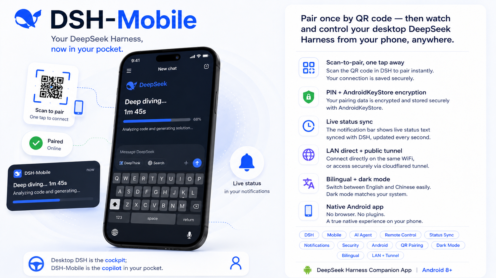
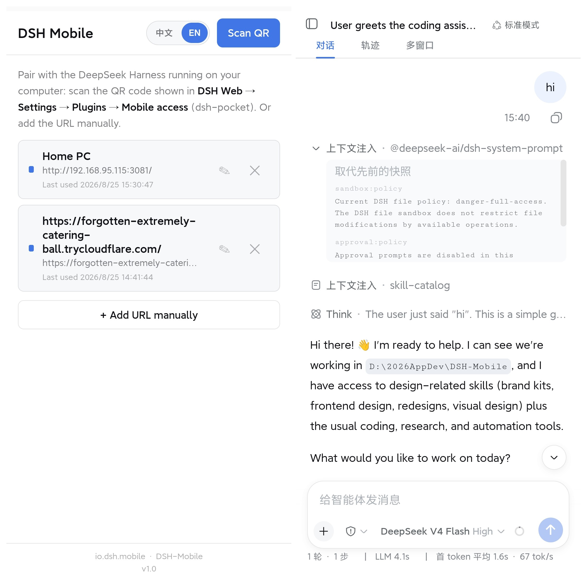

#  DSH-Mobile —— 把 DeepSeek Harness 装进口袋

[English](README.md) | **中文**

<p align="center">
  
  
  
  
  
  <a href="https://github.com/topics/dsh-plugin"></a>
</p>

<p align="center">
  
</p>

> **扫码配对一次，之后随时随地用手机查看/控制电脑上的 DeepSeek Harness。**
> **Pair once by QR code — then watch and control your desktop DeepSeek Harness from your phone, anywhere.**

**DSH-Mobile** 是官方 [DeepSeek Harness (DSH)](https://github.com/deepseek-ai/deepseek-harness)
Web 界面的**安卓原生配套 App**。扫码与电脑端 `dsh web` 配对后，以**整页导航**（非 iframe）
加载官方 DSH 界面；即使关掉 App，通知栏也会**逐秒同步**桌面上的原生进度文本。

## ✨ 它能做什么

| 能力 | 说明 |
|------|------|
| 📷 **扫码配对** | 扫 `dsh web → 设置 → 插件 → 手机访问` 的二维码，或手动输入地址 |
| 🔐 **PIN 自动登录** | 首次输入 8 位访问密码后以 **AndroidKeyStore AES-GCM 加密**保存；配对历史重开即达，免重复扫码 |
| 🖥️ **整页官方界面** | 远程页以 top-level 导航加载，会话 cookie / WebSocket 与桌面浏览器完全一致；窄屏适配由服务端 `dsh-web-mobile` 插件完成 |
| 🔔 **常驻状态通知** | 通知栏逐秒同步桌面原生状态文本（`Deep diving...1分45秒`）；任务结束自动转「已完成 · 本次用时」——**不自计时，与桌面显示永远一致** |
| 🌐 **局域网 + 公网** | 同一 WiFi 直连；外出走 cloudflared 快速隧道（URL 每次重启轮换） |
| 🌙 **深色模式 + 双语** | 跟随 DSH 的 `data-ds-dark-theme`；App 内 zh/en 随时切换 |
| 📶 **配对状态徽标** | 配对列表实时显示在线 / 离线 / 受密码保护（绿 / 红 / 锁） |
| 🔔 **通知权限** | Android 13+ 首次使用拉起系统授权，常驻状态条可选清除 |

> **桌面 DSH 是驾驶舱，DSH-Mobile 是口袋里的副驾。**

## 📸 运行效果

**📱 外部访问界面 & 对话显示界面** —— 扫码配对进入配对列表 / 远程入口，官方 DSH 界面整页呈现在手机：



> **App 图标** —— `assets/app-icon.png` 同时用作 APK 构建里的启动器图标：


## 🖼️ 架构

```
┌──────────────┐  扫码/手动配对          ┌────────────────────────────┐
│ DSH-Mobile   │ ─────────────────────→  │ 电脑端 dsh web (:3080)     │
│ Capacitor    │  URL (LAN :3081 或      │  ├ 官方 DSH Web UI          │
│ Android 壳   │  公网 trycloudflare)    │  ├ .Md3f7G_turnStatus 原生  │
│  ├ SecureStore (Keystore 加密)         │  │  状态文本（输入框上方）   │
│  ├ AuthBridge (原生 PIN 登录/导航)     │  └ dsh-pocket 代理(PIN 门)  │
│  ├ QrScanner (CameraX+ZXing, 无 GMS)   └────────────────────────────┘
│  └ MainActivity 状态轮询 → 常驻通知 │
└──────────────┘
```

关键设计：

- **整页导航而非 iframe**：`AuthBridgePlugin.open()` 把远程 URL 作为 top-level
  加载，天然同站——cookie / WebSocket 无需任何 hack；Android 返回键回配对列表。
- **无 cookie 探测**：`check()` 临时禁用 cookie 罐，确保已种 cookie 也不会
  掩盖 PIN 门的存在。
- **状态同步**：`MainActivity` 每 2s 读取桌面页面**原生** `.Md3f7G_turnStatus`
  文本（自带计时）——通知永远镜像桌面显示，而非本地估算；连续 4 次相同文本
  = 任务结束 → 「已完成 · 本次用时 <用时>」。

## 🚀 30 秒上手

```sh
# 1. 电脑端：安装两个服务端插件，再启动 dsh web
dsh plugin --profile web add dsh-pocket -w
dsh plugin --profile web add github:mexiaosqwq/dsh-web-mobile
npx @deepseek-ai/dsh web

# 2. 构建并安装 APK（或直接下载 Release 里的 APK）
cd app && npm install && npx cap sync android
cd android && .\gradlew.bat :app:assembleDebug
adb install -r app\build\outputs\apk\debug\app-debug.apk

# 3. 打开 App → 「扫码配对」→ 扫 dsh web → 设置 → 插件 → 手机访问 的二维码 → 完成 🎉
```

> 局域网访问密码（`lanAuthEnabled`）**默认开启**——安全默认。App 首次连接会
> 引导输入 8 位 PIN 并加密保存；可在插件设置里关闭（仅建议个人自用网络）。

## 为什么这样做

- **App 是壳，不是重写**：官方 DSH Web 界面原样加载，不改任何核心逻辑、不换皮。
- **钥匙留在电脑上**：PIN 存在电脑 `~/.dsh/dsh-pocket/`，手机只持有加密配对记录
  + 运行时会话 cookie——拆开 APK 也拿不到敏感信息。
- **进度就是桌面的进度**：通知读取与桌面同一个 `.Md3f7G_turnStatus` 元素，
  文本与时长天然一致，而非估算。
- **服务端做移动适配**：`dsh-web-mobile` 在页面发出前注入窄屏 CSS/JS，
  手机看到的是原生感的排版，而不是被挤压的桌面页。

## 目录结构

```
DSH-Mobile/
  app/                         Capacitor Android 工程（www 前端 + 原生插件）
    android/                   Android Studio 工程（MainActivity、AuthBridge、
                               QrScanner、SecureStore 插件）
    www/                       壳界面：配对列表 / 扫码 / 远程视图，zh-en 双语
  assets/                      宣传海报、App 图标、手机截图（合并的 screens.png）
  plugins/
    dsh-pocket/                二开上游：反向代理 + PIN 门（GPL-2.0，链接安装）
    dsh-web-mobile/            二开上游：移动端页面适配（MIT，链接安装）
  docs/                        市场调研 / 验证记录 / 架构 / 状态通知设计 / 宣传物料
  scripts/                     构建辅助、CDP 调试、事件流观察、图标生成
  scripts/lib/pocket-auth.cjs  开发脚本运行时获取会话 cookie 的 helper（不硬编码密钥）
  .github/workflows/build-apk.yml  CI：打 tag 自动构建 debug + release APK
  UPSTREAM.md                  上游源码版本记录
```

> `scripts/` 下的开发脚本（`listen-*.cjs`、`scan-bundle*.mjs`）通过
> `lib/pocket-auth.cjs` 在运行时获取会话 cookie（用本地 `~/.dsh/dsh-pocket/token-lan`
> 里的 PIN 现场登录，或读 `DSH_POCKET_COOKIE` 环境变量）。**不要把任何 cookie /
> PIN 硬编码进代码或提交到仓库。**

## 安装与启用

### 电脑端插件（必须）

```sh
# 方式 A：本地源码安装（开发/二开本仓库）
dsh plugin --profile web add link:/path/to/DSH-Mobile/plugins/dsh-pocket
dsh plugin --profile web add link:/path/to/DSH-Mobile/plugins/dsh-web-mobile

# 方式 B：从源安装（普通用户）
dsh plugin --profile web add dsh-pocket -w
dsh plugin --profile web add github:mexiaosqwq/dsh-web-mobile

# 重启 dsh web 生效
npx @deepseek-ai/dsh web
```

安装后：设置 → 插件 → 「手机访问」→ 出局域网二维码；点「开启公网访问」出公网二维码。

### 构建 App（Android）

```sh
cd app
npm install
npx cap sync android
cd android
# JDK 21（Capacitor 8 / AGP 8.13 要求，按实际路径调整）
$env:JAVA_HOME="$env:USERPROFILE\.jdks\openjdk-21.0.1"
.\gradlew.bat :app:assembleDebug
# 真机安装
adb install -r app\build\outputs\apk\debug\app-debug.apk
```

### Release 签名（分发 APK 前）

```sh
powershell -File scripts/init-release-signing.ps1   # 生成 keystore（仅一次）
cd app/android
.\gradlew.bat :app:assembleRelease                  # 输出 app-release.apk
```

无 keystore 时 release 构建自动退回 debug 签名（CI/本地验证可用）。

## 使用

1. **电脑端**：保持 `dsh web` + 两个插件运行。
2. **配对**：打开 App → 「扫码配对」扫二维码（同网络扫局域网码；外出先开公网隧道扫公网码）。
3. **首次 PIN**：App 自动登录 dsh-pocket 并加密保存 8 位 PIN，之后免输。
4. **日常**：打开 App 即官方界面——看会话、发消息、控制 agent；关掉 App，
   常驻状态通知继续盯进度。

## 🔐 安全模型

- **PIN 门**：`dsh-pocket` 在局域网（按开关）与公网隧道（始终）强制 8 位 PIN；
  登录带速率限制（单 IP 滑动窗口 + 全局锁），防穷举。
- **加密配对存储**：URL / PIN 存于 AndroidKeyStore（AES-GCM，KeyStore 生成 IV）。
- **会话 cookie**：`dsh_pocket_token`（30 天，HttpOnly）运行时从 CookieManager
  获取——App 从不内嵌凭证。
- **DSH 能在你电脑上执行代码**：配对 URL / PIN / 会话 cookie 就是钥匙——
  **不要分享、不要提交进仓库、不要贴到任何公开地方。**
- 公网 URL 每次重启轮换；局域网 PIN 建议保持开启。

## 📦 分发

| 渠道 | 方式 |
|------|------|
| **GitHub Release** | 打 tag 后 CI（`build-apk.yml`）自动构建 debug + release APK |
| **ADB / 侧载** | `adb install -r app-debug.apk`，或手机直接打开 APK |
| **源码构建** | 见下方「从源码构建」 |

## 🔍 发现与生态

- 遵循 DSH 插件生态：给仓库加 [`dsh-plugin`](https://github.com/topics/dsh-plugin)
  topic 即可在官方 topic 页被搜索到。
- 双语文档：`README.md`（英文）+ `README.zh.md`（中文），与官方
  `packages/client/*` 插件惯例一致。
- 二开上游保持只读（`plugins/`）；DSH-Mobile 专属逻辑全部在 `app/` 与 `scripts/`。

## 🏗️ 从源码构建

```sh
npm install                 # 根目录（docs/scripts 工具链依赖，如有）
cd app
npm install
npx cap sync android        # 由 www/ 重新生成 android 工程
cd android
$env:JAVA_HOME="$env:USERPROFILE\.jdks\openjdk-21.0.1"
.\gradlew.bat :app:assembleDebug
```

## License

按组件双许可：

- **App 壳**（`app/` 的 Capacitor 工程 + 自研原生插件）：**MIT** —— 可自由使用、修改、分发。
- **`plugins/dsh-pocket`**（二开上游）：**GPL-2.0** —— 任何修改或分发必须
  以 GPL-2.0 开源并保留版权声明。
- **`plugins/dsh-web-mobile`**（二开上游）：**MIT**。

具体版本见 `UPSTREAM.md`。
